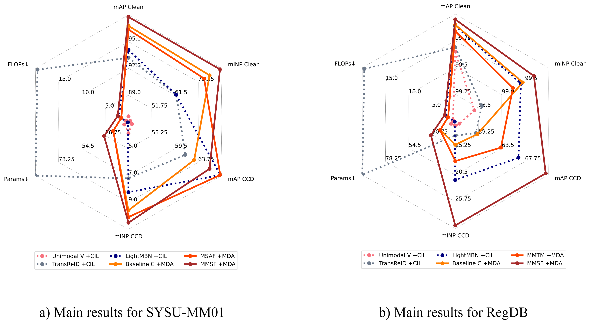

# Submitted to IJCV2023 multimodal special issue - Person ReID in Real-World Surveillance Using Corrupted Multimodal Data

Pytorch code for the Fusion for the [Visual-Infrared Person ReID in Real-World Surveillance Using Corrupted Multimodal Data paperpaper](https://arxiv.org/pdf/2305.00320.pdf). The code was developped on our preliminary work [1] code basis.

The proposed Multimodal Middle Stream Fusion (MMSF) model and other models* used in our study are available at the following link:

| Datasets      | Models                                                                     |
|---------------|----------------------------------------------------------------------------|
| #RegDB        | [GoogleDrive](https://drive.google.com/drive/folders/1QFlOFE_ySxspSyN2d3CuIkMxMVbRE062?usp=sharing)|
| #SYSU-MM01    | [GoogleDrive](https://drive.google.com/drive/folders/1eHD5ZlIduRN-wuqU98oCYc8Kc7pwry0U?usp=sharing)|
| #ThermalWORLD | [GoogleDrive](https://drive.google.com/drive/folders/1REfDp2HA_Y4hWDSl4SeA_ZTYhqqUuQyw?usp=sharing)|

The main results figures from our paper for the SYSU-MM01 and RegDB datasets are presented below:



**The code and google drive will be updated soon to integrate as well the MAN [2], MMTM [3], and MSAF [4] multimodal models used and adapted in our study.*

## 1. Prepare dataset 

### 1.1. Clean datasets

Datasets can be downloaded and used as ease.

- (1) RegDB Dataset [5]: The RegDB dataset can be downloaded from this [website](http://dm.dongguk.edu/link.html) by submitting a copyright form.

    - Named: "Dongguk Body-based Person Recognition Database (DBPerson-Recog-DB1) on their website). 

    - A private download link can be requested via sending an email to mangye16@gmail.com. 
  
- (2) SYSU-MM01 Dataset [6]: The SYSU-MM01 dataset can be downloaded from this [website](http://isee.sysu.edu.cn/project/RGBIRReID.htm).

- (3) ThermalWORLD Dataset [7]: Only the training part is used in our study as the whole dataset is not available. Repository is available [here](https://drive.google.com/file/d/1XIc_i3mp4xFlDJ_S5WJYMJAHq107irPI/view) and has been obtained from github ThermalGAN [issues](https://github.com/vlkniaz/ThermalGAN/issues/12).

### 1.2. Corrupted datasets

The proposed multimodal corrupted datasets, named Uncorrelated corrupted dataset (UCD) and Correlated Corrupted Datasets (CCD) are used for inference only. 

The data from the clean datasets is corrupted on the flow during inference. The code to corrupt the data is available in the ```./corruption``` folder.

Different samples are presented on the following image:


## 2. Train

To train our MMSF_0 model for RegDB fold 0 and using our ML-MDA multimodal data augmentation, run: 
```
python train.py --dataset=RegDB \
                --model=MMSF_0 \ 
                --data_path=../Datasets \
                --models_path=../save_model \
                --reid=BtoB \
                --ML_MDA \
                --fold=0;
```

  - `--dataset`: which dataset: "SYSU", "RegDB", or "TWorld".

  - `--model`: which model: "MMSF", "concatenation" [1], "unimodal", "LMBN" [8], or "transreid" [9].
  
  - `--data_path`: Location of the dataset.

  - `--models_path`: Storage location of the learned models.

  - `--reid`: "BtoB" for concatenation model, "VtoV" for others.
  
  - `--ML_MDA`: Training using our ML-MDA strategy.
  
  - `--fold`: Fold to train from 0 to 4. 

To fully learn a model (5 folds), and select the wanted model/learning parameters dynamically, run ```bash train.sh``` file and tune the required parameters accordingly.

## 3. Inference

To test the MMSF_0 model for RegDB-UCD, learned using ML-MDA, run similarly:

```
python test.py  --dataset=RegDB \
                --scenario_eval=UCD \
                --model=MMSF_0 \
                --data_path=../Datasets \
                --models_path=../save_model \
                --reid=BtoB \
                --ML_MDA;
```

  - `--dataset`: which dataset: "SYSU", "RegDB", or "TWorld".

  - `--model`: which model: "unimodal", "concatenation", "LMBN" [5], or "transreid" [6].
  
  - `--data_path`: Location of the dataset.

  - `--models_path`: Storage location of the learned models.

  - `--reid`: "BtoB" for concatenation model, "VtoV" for others.
  
  - `--ML_MDA`: Model trained using our ML-MDA strategy.
  
  - `--scenario_eval`: Evaluation type, "normal" for clean datasets, "C" for visible modality corrupted only, "UCD" for our uncorrelated corrupted dataset, and "CCD" for our correlated corrupted dataset. 

To test a model and select the wanted inference parameters dynamically, run ```bash test.sh``` file and tune the required parameters accordingly.

**Results may slightly vary from the paper for evaluation done on corrupted test sets as transformations are randomly applied.*

## 4. References

[1] Josi, A., Alehdaghi, M., Cruz, R. M. & Granger, E. (2023). Multimodal Data Augmentation for Visual-Infrared Person ReID with Corrupted Data. Proceedings of the IEEE/CVF Winter Conference on Applications of Computer Vision, pp. 32–41.

[2] Ismail, A. A., Hasan, M. & Ishtiaq, F. (2020). Improving Multimodal Accuracy Through Modality Pre-training and Attention. arXiv:2011.06102.

[3] Joze, H. R. V., Shaban, A., Iuzzolino, M. L. & Koishida, K. (2020). MMTM: Multimodal transfer module for CNN fusion. Proceedings of the IEEE/CVF Conference on Computer Vision and Pattern Recognition, pp. 13289–13299.

[4] Su, L., Hu, C., Li, G. & Cao, D. (2020). MSAF: Multimodal Split Attention Fusion. arXiv:2012.07175.

[5] D. T. Nguyen, H. G. Hong, K. W. Kim, and K. R. Park. Person recognition system based on a combination of body images from visible light and thermal cameras. Sensors, 17(3):605, 2017.

[6] A. Wu, W.-s. Zheng, H.-X. Yu, S. Gong, and J. Lai. Rgb-infrared crossmodality person re-identification. In IEEE International Conference on Computer Vision (ICCV), pages 5380–5389, 2017.

[7] Kniaz, V. V., Knyaz, V. A., Hladuvka, J., Kropatsch, W. G., & Mizginov, V. (2018). Thermalgan: Multimodal color-to-thermal image translation for person re-identification in multispectral dataset. In Proceedings of the European Conference on Computer Vision (ECCV) Workshops (pp. 0-0).

[8] Herzog, F., Ji, X., Teepe, T., Hörmann, S., Gilg, J., & Rigoll, G. (2021, September). Lightweight multi-branch network for person re-identification. In 2021 IEEE International Conference on Image Processing (ICIP) (pp. 1129-1133). IEEE.

[9] He, S., Luo, H., Wang, P., Wang, F., Li, H., & Jiang, W. (2021). Transreid: Transformer-based object re-identification. In Proceedings of the IEEE/CVF international conference on computer vision (pp. 15013-15022).

## Citation

If this work helped your research, please kindly cite our paper:
```
@article{josi2023fusion,
  title={Fusion for Visual-Infrared Person ReID in Real-World Surveillance Using Corrupted Multimodal Data},
  author={Josi, Arthur and Alehdaghi, Mahdi and Cruz, Rafael MO and Granger, Eric},
  journal={arXiv preprint arXiv:2305.00320},
  year={2023}
}
```